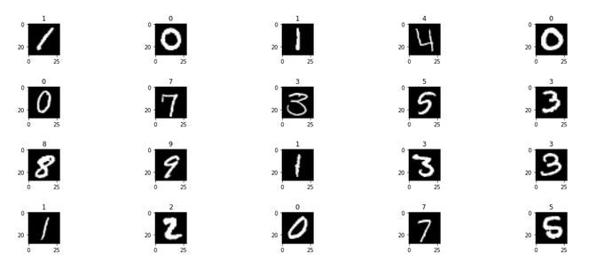
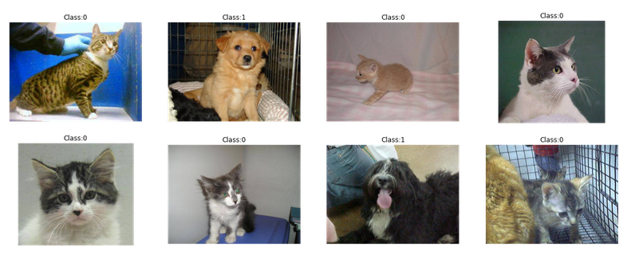

<!-- # Luís Gabriel Pereira Condados -->

# Contatos e Informações:
Email: [condadoslgpc@gmail.com](condadoslgpc@gmail.com)\
Github: [github.io/gabriellgpc](github.io/gabriellgpc)\
Linkedin: [linkedin.com/in/lgabrielpc](https://www.linkedin.com/in/lgabrielpc)\
Lattes: [lattes.cnpq.br/7552086880914030](http://lattes.cnpq.br/7552086880914030)\
Youtube: [youtube.com/channel/UCGqW9GuMni6KTZkLF2dxu4g](https://www.youtube.com/channel/UCGqW9GuMni6KTZkLF2dxu4g)\
Kaggle: [kaggle/condados](https://www.kaggle.com/condados)

-------
- [Contatos e Informações:](#contatos-e-informações)
- [Machine Learning](#machine-learning)
  - [Digit Recognizer](#digit-recognizer)
  - [classification challenge - Dogs vs. Cats](#classification-challenge---dogs-vs-cats)
  - [Working on: RSNA Pneumonia Detection Challenge](#working-on-rsna-pneumonia-detection-challenge)
- [Computer Vision and Image Digital Processing](#computer-vision-and-image-digital-processing)
  - [Filtragem Convolucional 2D](#filtragem-convolucional-2d)
  - [Projetos básicos de Visão Computacional com OpenCV e Python](#projetos-básicos-de-visão-computacional-com-opencv-e-python)
  - [Programas Desenvolvidos na Disciplina de Processamento Digital de Imagens](#programas-desenvolvidos-na-disciplina-de-processamento-digital-de-imagens)
  - [Programas Desenvolvidos na Disciplina de Visão Computacional](#programas-desenvolvidos-na-disciplina-de-visão-computacional)
  - [Filtro de Borramento Adaptativo](#filtro-de-borramento-adaptativo)
  - [Transformada Hough para Identificação de Quadrados](#transformada-hough-para-identificação-de-quadrados)
  - [Arte Com Fios](#arte-com-fios)
- [Robotics](#robotics)
  - [Projeto: Futrobot - Software da Equipe Poti de Futebol de Robôs](#projeto-futrobot---software-da-equipe-poti-de-futebol-de-robôs)
  - [Path Planning Using Potential Field Algorithm and Occupancy Grid on the CoppeliaSim (VREP)](#path-planning-using-potential-field-algorithm-and-occupancy-grid-on-the-coppeliasim-vrep)
  - [Occupancy grid on the CoppeliaSim (VREP)](#occupancy-grid-on-the-coppeliasim-vrep)
  - [Self Driving Car on Carla Simulator](#self-driving-car-on-carla-simulator)
  - [Path Follower, Position Controller and Trajectory Controller (Kinematic Controllers). Simulation on CoppeliaSim](#path-follower-position-controller-and-trajectory-controller-kinematic-controllers-simulation-on-coppeliasim)
  - [Identificação de Colisão em Espaço de Configuração](#identificação-de-colisão-em-espaço-de-configuração)
- [Embedded Systems](#embedded-systems)
  - [Futrobot-firwmare](#futrobot-firwmare)
  - [Projeto de Controle Embarcado para Robôs com Acionamento Diferencial e Encoders de Baixa Resolução](#projeto-de-controle-embarcado-para-robôs-com-acionamento-diferencial-e-encoders-de-baixa-resolução)
- [Graphics Computing](#graphics-computing)
  - [Implementação do Algoritmo Raytracer em C++](#implementação-do-algoritmo-raytracer-em-c)
- [Communication Systems](#communication-systems)
- [Biblioteca BluetoothAction](#biblioteca-bluetoothaction)
- [Workshops](#workshops)
  - [Workshop: Python Overview](#workshop-python-overview)
- [Alguns dos Projetos que Estou Organizando para Publicar Aqui](#alguns-dos-projetos-que-estou-organizando-para-publicar-aqui)
- [Tutoriais e Dicas](#tutoriais-e-dicas)
  - [Linux](#linux)
  - [Python Virtual Environment](#python-virtual-environment)
  - [VSCode](#vscode)
  - [Vim](#vim)
  - [Template ESP Project](#template-esp-project)

Ainda estou organizando essa página, vou deixar essa misturada de inglês com português por hora ...

-------
# Machine Learning
## [Digit Recognizer](https://www.kaggle.com/condados/first-project-mnist-digit-nn)
  "MNIST ("Modified National Institute of Standards and Technology") is the de facto “hello world” dataset of computer vision. Since its release in 1999, this classic dataset of handwritten images has served as the basis for benchmarking classification algorithms. As new machine learning techniques emerge, MNIST remains a reliable resource for researchers and learners alike.

  In this competition, your goal is to correctly identify digits from a dataset of tens of thousands of handwritten images. We’ve curated a set of tutorial-style kernels which cover everything from regression to neural networks. We encourage you to experiment with different algorithms to learn first-hand what works well and how techniques compare."[Kaggle](https://www.kaggle.com/c/digit-recognizer).

  

## [classification challenge - Dogs vs. Cats](https://www.kaggle.com/condados/my-cnn-for-dog-vs-cats)
  In this competition, I wrote an algorithm to classify whether images contain either a dog or a cat. The training archive contains 25,000 images of dogs and cats (1 = dog, 0 = cat).[Dogs vs Cats Competition](https://www.kaggle.com/c/dogs-vs-cats/overview)

  

## [Working on: RSNA Pneumonia Detection Challenge](https://www.kaggle.com/c/rsna-pneumonia-detection-challenge/overview)
In this competition, the challenge is to build an algorithm to detect a visual signal for pneumonia in medical images. Specifically, the algorithm needs to automatically locate lung opacities on chest radiographs.

# Computer Vision and Image Digital Processing

## [Filtragem Convolucional 2D](https://github.com/Gabriellgpc/my_personal_projects/tree/main/computer_vision/conv_from_scratch)
  Implementação em C++ da operação de convolução com parâmetros adicionais (stride e padding).
  Criei uma classe **Imagem**, apenas para trabalhar com imagens em tons de cinza (poderia ter feito colorido também, sem grandes dificuldades a mais) e para carregar e salvar imagens da memória eu decidi trabalhar com o padrão PGM ([Documento](https://en.wikipedia.org/wiki/Netpbm#File_formats) sobre o projeto **Netpbm** e os formatos de imagens definidos por eles.) que é o mais simples para implementar, embora ocupe muito espaço de memoria.
  
  A função que implementa a convolução **conv2D** recebe como parâmetros:
- Uma Imagem
- kernel/máscara(prefiro o termo kernel): um vetor de float
- f: tamanho do kernel (f x f)
- s: stride, "saltos que o kernel dará durante a convolução" o padrão é 1
- p: padding, quanto que a imagem original vai ser expandida antes de operar
- same: boolean que se passado como true a imagem resultante possuirá as mesmas dimensões que a imagem de entrada, caso seja false (padrão) as dimensões da imagem de saída serão:

$width_{out} = floor(\frac{width_{in} + 2*p - f}{s} + 1)$

$height_{out} = floor(\frac{height_{in} + 2*p - f}{s} + 1)$

O caso sem usar padding e stride (caso "normal"):

$p = 0$, $s = 1$,

$width_{out} = width_{in}-f + 1$

$height_{out} = height_{in} - f + 1$

  

## [Projetos básicos de Visão Computacional com OpenCV e Python](https://github.com/Gabriellgpc/my_personal_projects/tree/main/computer_vision)
  Não sei se vale a pena documentar para postar aqui ainda... Provavelmente vou deixar eles um pouco mais interessantes e fazer as versões em C++ antes de colocar um por um aqui.

## [Programas Desenvolvidos na Disciplina de Processamento Digital de Imagens](https://gabriellgpc.github.io/processamento_digital_de_imagens_UFRN/)
  O link leva para um blog que fiz para servir como documentação online das atividades que desenvolvi durante a disciplina de Processamento Digital de Imagens do Departamento de Engenharia de Computação e Automação (DCA) da UFRN, a disciplina foi ministrada pelo professor Dr. [Agostinho de Brito Junior](https://agostinhobritojr.github.io/).

## [Programas Desenvolvidos na Disciplina de Visão Computacional](https://gabriellgpc.github.io/visao_computacional_DIM0141/)
  O link leva para um blog que fiz para servir como documentação online das atividades que desenvolvi durante a disciplina de Visão Computacional da UFRN, a disciplina foi ministrada pelo professor Dr.[Rafael Beserra Gomes](https://dimap.ufrn.br/~rafaelbg/index.html).

## [Filtro de Borramento Adaptativo](https://github.com/Gabriellgpc/my_personal_projects/tree/main/computer_vision/adaptive_blurring)
  O título resumiu bem o que o programa faz, mas sendo um pouco mais específico, o programa recebe uma imagem e aplica um filtro de borramento que é mais forte em regiões de não borda e um mais suave em regiões de borda.

  

## [Transformada Hough para Identificação de Quadrados](https://github.com/Gabriellgpc/my_personal_projects/tree/main/computer_vision/hough_square)
  A transformada de *Hough* é um método comum para detecção de formas que são facilmente parametrizáveis (formas comuns: linhas e círculos). Geralmente essa transformada é utilizada após a etapa de pré-processamento de detecção de bordas.

  O método consiste em mapear determinados pixeis da imagem numa determinada célula no espaço de parâmetros que definem a figura geométrica. Esse procedimento é repetido para toda a imagem e as células do espaço de parâmetros são incrementadas, servindo assim de indicadores da existência de uma determinada forma.

  O trabalho apresenta uma implementação da transformada *Hough* para a identificação de quadrados pretos em imagens com fundo branco, o método usado é baseado na informação gradiente da imagem. Para isso foi feito a parametrização de um quadrado com a informação do centro do quadrado, tamanho do lado e orientação com relação ao eixo horizontal ($x_c, y_c, l, \theta$), por isso o espaço de configuração terá dimensão $4$. Para fazer o mapeamento entre o espaço de imagem e o de parâmetros foi utilizado a informação do gradiente da imagem e um ponto de borda, para com isso obter-se as normais do quadrado e com isso estimar os quatro parâmetros. Após o mapeamento/acumulo dos indicadores é feito uma etapa de filtragem dos quadrados, para melhorar a precisão da detecção.

  

## [Arte Com Fios](https://github.com/Gabriellgpc/my_personal_projects/tree/main/computer_vision/knitty_art)
Este projeto se trata da minha implementação para reproduzir o trabalho de arte com fios [Art Nitka](https://www.instagram.com/art.nitka/?utm_source=ig_embed). O programa recebe uma imagem e gera, através de um processo por busca exaustiva, uma imagem feita apenas com linhas pretas em um fundo branco que tenta reproduzir a imagem original.

# Robotics
## [Projeto: Futrobot - Software da Equipe Poti de Futebol de Robôs](https://github.com/potiufrn/Futrobot)
Software desenvolvido pela Equipe Poti de futebol de robôs do Departamento de Computação e Automação(DCA) da UFRN voltado para o desenvolvimento de pesquisas em robótica e participações em competições de futebol de robôs ([Aqui](https://potiufrn.github.io/) você pode ler mais a respeito de alguns dos trabalhos realizados).

Um pouco sobre as técnologias utilizadas no software:
* Escrito em **C e C++**
* Compilação gerenciada por meio de **Makefile** (usando bastante dos recursos "smart" do **make**, ficou quase tão simples quanto usar CMake :p)
* **Linux**
* **Qt** para fazer as interfaces gráficas, mas o sistema também roda direto pelo terminal, porém é necessário usar a interface pelo menos para fazer a calibração das cores (o sistema de visão utiliza segmentação por cores)
* **bluetooth** para comunicação com o host(pc) e os robôs (frota de três robôs)
* No mais é C++ para fazer: processamento de imagem, visão computacional, IA, controle ...
* **v4l2** (video for linux 2) utilizada para construir a biblioteca para controle da câmera (configuração e consulta dos parâmetros da câmera) e para captura de imagens em YUYV ou RGBG.

<!--  -->

**Algumas informações prévias:**
  A manipulação do sistema é feita via Terminal do Linux, tendo a interface gráfica apenas o módulo de calibração.

## [Path Planning Using Potential Field Algorithm and Occupancy Grid on the CoppeliaSim (VREP)](https://www.youtube.com/watch?v=_S35ZPSqSBo&ab_channel=Lu%C3%ADsGabriel)
Simulação usando CoppeliaSim (antigo VREP), projeto em C++ (from scratch) de um planejador de caminhos baseado em campos potenciais. Source Code [here](https://github.com/Gabriellgpc/sistemas_roboticos_autonomos/tree/master/program/p3m3). 
**Obs.:** Deixarei um relatório em PDF explicando o funcionamento geral do sistema.

## [Occupancy grid on the CoppeliaSim (VREP)](https://www.youtube.com/watch?v=5lMkQWt_dUw&ab_channel=Lu%C3%ADsGabriel)
Projeto em C++ de construção de uma grade de ocupação probabilística (from scratch). Source code [here](https://github.com/Gabriellgpc/sistemas_roboticos_autonomos/tree/master/program/p3m2).
**Obs.:** Deixarei um relatório em PDF explicando o funcionamento geral do sistema.

## [Self Driving Car on Carla Simulator](https://www.youtube.com/watch?v=oaez0aPVfI4&ab_channel=Lu%C3%ADsGabriel)
I lost my source code :'(, I will do a new version afterward. I made that project during my Self Driving Cars specialization from [Coursera](https://www.coursera.org/specializations/self-driving-cars).

**Demos**:
- [Lateral and Horizontal Controller 1](https://www.youtube.com/watch?v=Xr--q2T92P4&ab_channel=Lu%C3%ADsGabriel)
  - [Lateral and Horizontal Controller 2](https://www.youtube.com/watch?v=oaez0aPVfI4&ab_channel=Lu%C3%ADsGabriel)
- [My Final Self Driving Car System](https://www.youtube.com/watch?v=axL8ux_x6Vs&t=187s&ab_channel=Lu%C3%ADsGabriel)

## [Path Follower, Position Controller and Trajectory Controller (Kinematic Controllers). Simulation on CoppeliaSim](https://www.youtube.com/watch?v=KIsikoNiXtg&ab_channel=Lu%C3%ADsGabriel)
Implementação em C++ de controladores cinemáticos clássicos (from scratch). Source code [here](https://github.com/Gabriellgpc/sistemas_roboticos_autonomos/tree/master/program/p1m3)
- Seguidor de Caminho
- Seguidor de Trajetória
- Controle Estabilizando / Posição

## [Identificação de Colisão em Espaço de Configuração](https://www.youtube.com/watch?v=NvBI5x8xyeY&t=896s&ab_channel=Lu%C3%ADsGabriel)
Simulação usando CoppeliaSim e programa em C++ para identificação de colisão em espaço de configuração (from scratch!).

**Obs.:** Quando fiz o vídeo eu ainda estava aprendendo sobre o conteúdo, então acabei não explicando muito bem alguns pontos, mas a ideia geral está correta. Source code [here](https://github.com/Gabriellgpc/sistemas_roboticos_autonomos/tree/master/program/p2m1). 

# Embedded Systems

## [Futrobot-firwmare](https://github.com/potiufrn/Futrobot-firmware)
Software embarcado (firmware) para os robôs da Equipe Poti de futebol de robôs 2020.

Estou organizando ainda essa página e a documentação, logo mais deixarei uma descrição melhor do projeto aqui e uma documentação lá :)

## [Projeto de Controle Embarcado para Robôs com Acionamento Diferencial e Encoders de Baixa Resolução](https://github.com/Gabriellgpc/TCC---Controle-Embarcado/blob/main/TCC_LGabriel.pdf)

Projeto em Latex do Meu TCC no link do título do projeto :). E aqui é a apresentação (também um projeto Latex) que fiz para a defesa: [Slide Apresentação](https://github.com/Gabriellgpc/Apresentacao_TCC).

Implementação de um esquema de controle do tipo feedforward/backward para controle das velocidades angulares dos motores de um mini robô com acionamento diferencial (acionamentos independentes/um motor por roda) com sensores (Encoders magnéticos) de baixa resolução. \
Algumas das tecnologias utilizadas:
- **Filtro de Kalman**: Foi utilizado como estimador de estado (faz uso do modelo do sistema/motor, sinal de entrada / pwm e leitura do sensor para fazer a melhor estimativa da velocidade de rotação do motor);
- **Linguagem de Programação C e ESP-SDK**: Programei em C usando o kit de desenvolvendo (libs) da desenvolvedora do mesmo (ESP-SDK).

# Graphics Computing
## [Implementação do Algoritmo Raytracer em C++](https://github.com/Gabriellgpc/raytracing)
Implementação do algoritmo de renderização raytracing em C++ e usando [openGL](https://www.opengl.org/)(criação da imagem rasterizada) e [OpenMP](https://www.openmp.org/)(para processamento paralelo).

Vou documentar lá ainda e melhorar esta descrição...
Se liga num vídeozinho massa de demostração dessa implementação: [video de demostração](https://www.youtube.com/watch?v=QzKdFQ4jB-k).

# Communication Systems
# [Biblioteca BluetoothAction](https://github.com/potiufrn/bluetoothAction)
Biblioteca criada e mantida pelo laboratório de robótica do DCA. Fiz alguns algumas modificações para torna-la mais genérica (foi criada para ser usada no [Futrobot](##[Futrobot-firwmare](https://github.com/potiufrn/Futrobot-firmware)))

# Workshops
## [Workshop: Python Overview](https://github.com/Gabriellgpc/python_workshop_overview)
Material que criei para ministrar um workshop sobre a linguagem de programação python para o time de rocket design da UFRN ([Potiguar Rocket Design](https://www.youtube.com/channel/UCWEqiELiw2ohrE56GyWJAcg/featured)) em 2020.

A ideia era mostrar e ensinar o básico (com práticas e demostrações) sobre ferramentas úteis para a realidade da grande maioria dos integrantes do time (estudantes de engenharia mecânica em sua maioria) como:
* Ambiente Jupyter notebook / Colab
* Python básico
* Programação orientada a objetos com python
* Numpy
* Matplotlib
* Scipy
* Pandas

# [Alguns dos Projetos que Estou Organizando para Publicar Aqui](https://github.com/Gabriellgpc/my_personal_projects)
  Vou introduzir cada um deles aqui e criar uma documentação em cada um deles ainda.

# [Tutoriais e Dicas](https://github.com/Gabriellgpc/my_personal_projects/tree/main/tutorial)
Tutoriais de download, instalação e uso das principais ferramentas/tecnologias que uso para desenvolver

## Linux
Comandos que me foram/são úteis e que não posso esquecer...

## Python Virtual Environment
Básico sobre ambientes virtuais em python 3.

## VSCode
Provavelmente vou deixar uma lista com o nome das extensões que eu gostei de utilizar com um overview sobre cada um.

## Vim
Já fiz o tutorial algumas vezes mas sempre acabo navegando usando as setas -_-

## [Template ESP Project](https://github.com/Gabriellgpc/esp-idf-project)

Tenho até que atualizar lá e colocar um manual de instalação e configuração do ambiente ainda...
